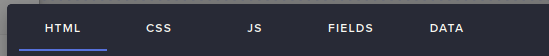

# StreamElements Terminal Alert Widget

A custom StreamElements Widget that show various alerts.

### How can I use it?

```bash
npm i
npm run build
```

Open directory `./dist` and check the files:
- index.html
- style.css
- main.js
- fields.json
- data.json

Put the content of each file in its own tab respectively in a StreamElements' Custom Widget (Settings -> Open Editor)


